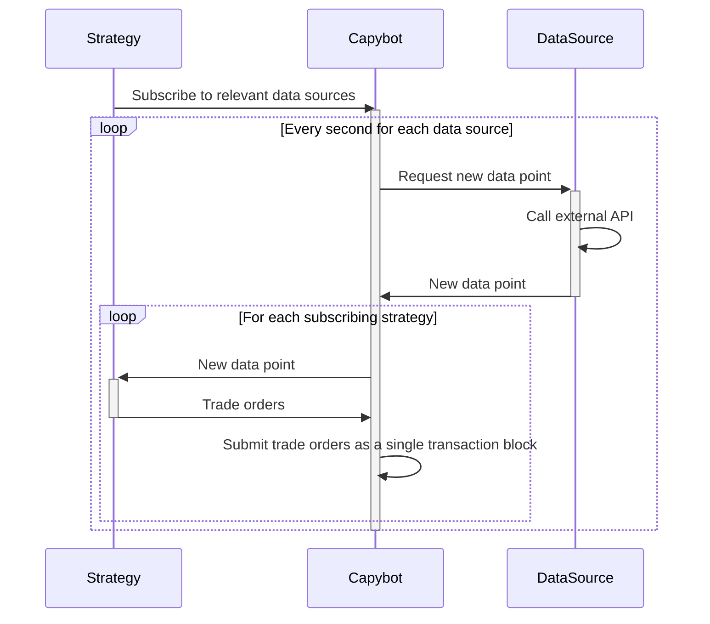
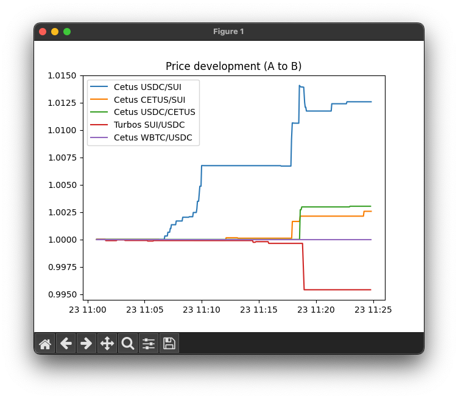

# Capy Trading Bot

This repository contains simple DeFi bots in Typescript, which are designed to find and take advantage of arbitrage opportunities in different SUI DEXs and/or perform trading activities based on script-logic strategies. Since it is still in BETA version, the agents might not be profitable and are mainly open-sourced as a reference implementation that could be reused to implement custom strategies.

## Features

-   Implements a basic `Strategy` interface (developers can implement their own strategies).
-   Provides three basic trading strategies as reference implementations (described later in this Readme).
-   Automatically executes trades when it finds profitable opportunities.
-   Supports multiple cryptocurrencies and trading pairs; currently supporting trading on three Sui DEXs.
-   Supports receiving data from multiple sources, including swap pools and external sources like Binance. Currently, the bot utilizes feeds from [CCTX (CryptoCurrency eXchange Trading Library)](https://github.com/ccxt/ccxt) to get the latest prices from Binance. Note that CCTX supports Binance, Bitget, Coinbase, Kraken, KuCoin and OKX, and it is straight-forward to accept feeds from these CEXs as well.

## Overview

In Capy Trading Bot, **strategies** subscribe to relevant **data sources** and create **trade orders** based on the information they get. Every second, Capy Trading Bot requests new data points from each data source. When it receives a new data point, Capy Trading Bot sends it to subscribing strategies which return trade orders to Capy Trading Bot. Capy Trading Bot submits transactions to the relevant swap pools modules to execute these trade orders. If a strategy returns multiple trade orders, Capy Trading Bot submits them as a single transaction.



## Strategies

Capy Trading Bot supports the following three trading strategies:

-   `Arbitrage`: This strategy looks for [arbitrage opportunities](https://en.wikipedia.org/wiki/Triangular_arbitrage) in chains of two or more swap pools across different DEXs. It computes the product of the prices along the chain of swap pools, say SUI -> USDC -> CETUS -> SUI, and if the product is different from 1 it means there is an arbitrage opportunity.
-   `RideTheTrend`: This strategy looks for [trend following](https://en.wikipedia.org/wiki/Trend_following) opportunities in a single swap pool by comparing a short moving average with a longer moving average to get an indication whether the price is going up or down.
-   `MarketDifference`: This strategy compares the relative price of a token pair in a swap pool with the price of the same pair on an exchange, such as Binance. If the price differs, the strategy suggests to either go long or short a given token.

Strategies are located in the `src/strategies` folder, and each strategy extends the `Strategy` class which requires the
`evaluate` method to be implemented. The `evaluate` method is called every second with the latest data point from the
data sources and should return a (potentially empty) array of trade orders.

To add other strategies, you can implement them as described above and add it to Capy Trading Bot by calling `capybot.addStrategy` in `src/index.ts`.

## Data sources

Capy Trading Bot can leverage two different types of data sources: Swap pools and external sources. Capy Trading Bot can execute trades via swap pools, and swap pools provide the current token price in the pool. External data sources can provide additional data that could be useful inputs to trading strategies.

In this release, Capy Trading Bot supports swap pools from [Cetus](https://www.cetus.zone/), [Turbos](https://turbos.finance/) and
[Suiswap](https://suiswap.app/app/), and uses Binance (via [CCTX](https://github.com/ccxt/ccxt)) as an external data source for the relative prices of some token pairs.

## Installation

1. Clone this repository.
2. Install dependencies with `npm install`.

## Usage

### Set two environment variables

Before you run the script, you need to set two environment variables: `ADMIN_PHRASE` and `ADMIN_ADDRESS`.
The `ADMIN_PHRASE` is the passphrase for your account, and the `ADMIN_ADDRESS` is the hexadecimal address of your account. You can export them using the following commands in your terminal:

```shell
export ADMIN_PHRASE="your_passphrase_here"
export ADMIN_ADDRESS="your_address_here"
```

Before you continue with the next steps, make sure to replace the placeholders with your actual values. Do not share your passphrase or address with anyone else.

### Declare Pools

On the following snippet of code, we declare 3 pools

```typescript
const USDCtoSUI = new Pool('0x0...1', coins.USDC, coins.SUI)

const USDTtoSUI = new Pool('0x0...2', coins.USDT, coins.SUI)

const USDCtoUSDT = new Pool('0x0...3', coins.USDC, coins.USDT)
```

### Add a triangular arbitrage strategy

To execute a triangular arbitrage strategy, a trader makes 3 transactions:
first, exchange the original token for another one (i.e. SUI -> USDC);
second, swap the second token for a third one (i.e. USDC -> USDT); and
third, trade the third token back to the original one (i.e. USDT -> SUI).

On the following snippet of code we add a triangular arbitrage strategy to the capybot.

```typescript
// Add triangular arbitrage strategy: USDC/SUI -> (USDT/SUI)^-1 -> (USDC/USDT)^-1.
capybot.addStrategy(
    new Arbitrage(
        [
            {
                pool: SUItoUSDC.uri,
                a2b: true,
            },
            {
                pool: USDCtoUSDT.uri,
                a2b: true,
            },
            {
                pool: USDTtoSUI.uri,
                a2b: true,
            },
        ],
        defaultAmount[coins.SUI],
        ARBITRAGE_RELATIVE_LIMIT,
        'Arbitrage: SUI -> USDC -> USDT -> SUI'
    )
)
```

`ARBITRAGE_RELATIVE_LIMIT` represents the relative limit. e.g. 1.05 for a 5% win.

### Add a ride the trend strategy

Ride the trend strategy is a trading technique that involves following the direction of the market movement and staying in a position until the trend reverses. The idea is to capture as much profit as possible from a strong and sustained price movement.
To apply this strategy, traders need to identify the trend using technical indicators, such as moving averages and enter a trade when the price confirms the trend.

On the following snippet of code, we add a Ride The Trend strategy to the capybot.

```typescript
capybot.addStrategy(
    new RideTheTrend(
        SUItoUSDC.uri,
        5,
        10,
        [
            defaultAmount[SUItoUSDC.coinTypeA],
            defaultAmount[SUItoUSDC.coinTypeB],
        ],
        RIDE_THE_THREAD_LIMIT,
        'RideTheTrend (SUI/USDC)'
    )
)
```

It takes six parameters as input:

-   pool: The address of the pool to watch.
-   short: The length of the short moving average (in seconds).
-   long: The length of the long moving average (in seconds).
-   defaultAmounts: An array of two numbers, representing the amount of tokens to swap of coin type A and B respectively when the trend changes.
-   limit: A number between 0 and 1, representing the percentage of profit or loss to accept before executing a swap. For example, 1.05 means a 5% profit margin.
-   name: A human-readable name for this strategy.

It calculates the moving averages of the pool price and it then compares the short and long moving averages to determine the trend direction. When the trend changes, it executes a swap, with the specified swap amounts and relative limit.

### Market Difference

The bot can also use external data sources. For example, if there is a price discrepancy between Binance and a SUI DEX, the bot can arbitrage by buying/selling tokens on the DEX.

On the following snippet of code, we create a new market difference strategy. This strategy compare prices between a pool and various exchanges and will buy the token that is too cheap and sell the token that is too expensive.

```typescript
capybot.addStrategy(
    new MarketDifference(
        WBTCtoUSDC,
        'BinanceBTCtoUSDC',
        [defaultAmount[coins.WBTC], defaultAmount[coins.USDC]],
        ARBITRAGE_RELATIVE_LIMIT,
        'Market diff: (W)BTC/USDC, Binance vs DEX'
    )
)
```

The following parameters are required:

-   pool: The pool to monitor for price changes.
-   exchange: The exchange to compare with the pool. It should offer the same trading pairs as the pool.
-   defaultAmounts: The default amounts of tokens to trade when the price difference exceeds the limit.
-   limit: The relative threshold for the price difference. A trade will be executed if the price difference is greater than this value.
-   For example, a value of 1.05 means that the price difference should be at least 5%.
-   name: A human-readable name for this strategy.

## Build and Run the Bot

Build the project with `npm run build`

Run the script with `npm run start`

This will run the bot for one hour. To run the bot for longer you should change the `duration` value in the call to `capybot.loop` in `src/index.ts`.

## Monitoring

The Capybot Monitor is a collection of Python scripts to monitor the status of a running instance of a Capybot. It produces live updated plots like the following which shows the price development for the swap pools the given Capybot was trading where 1 is the price when the bot was started.



Installation instructions are available on the [Capybot Monitor repository](https://github.com/MystenLabs/capybot-monitor).

## Pools

The table below lists all the pools for the 3 DEXs:

| DEX     | Coin A - CoinB   | Pool                                                               |
| ------- | ---------------- | ------------------------------------------------------------------ |
| CETUS   | USDT - USDC      | 0xc8d7a1503dc2f9f5b05449a87d8733593e2f0f3e7bffd90541252782e4d2ca20 |
|         | SUI - USDC       | 0xcf994611fd4c48e277ce3ffd4d4364c914af2c3cbb05f7bf6facd371de688630 |
|         | CETUS - SUI      | 0x2e041f3fd93646dcc877f783c1f2b7fa62d30271bdef1f21ef002cebf857bded |
|         | WETH - USDC      | 0x5b0b24c27ccf6d0e98f3a8704d2e577de83fa574d3a9060eb8945eeb82b3e2df |
|         | CETUS - USDC     | 0x238f7e4648e62751de29c982cbf639b4225547c31db7bd866982d7d56fc2c7a8 |
|         | SUIP - USDC      | 0x20739112ab4d916d05639f13765d952795d53b965d206dfaed92fff7729e29af |
|         | SUI - USDT       | 0x06d8af9e6afd27262db436f0d37b304a041f710c3ea1fa4c3a9bab36b3569ad3 |
|         | MED - SUI        | 0x3f40c8bbb1c986a513373c9229bdccfe36d3d030f86d5207833b03859e48a3a9 |
|         | USDCsol - USDC   | 0xc93fb2ccd960bd8e369bd95a7b2acd884abf45943e459e95835941322e644ef1 |
|         | LUCK - SUI       | 0xe75e51f369e3d5e29dd32a00e6abec8d01be9bf351653c2a24f016625180c39d |
|         | SBOX - SUI       | 0xdf74c23ff4516486c8a740c3208485883665a3f386455b37ef5715b3094d5ed8 |
|         | USDCpol - USDC   | 0x9b2a5da1310657a622f22c2fb54e7be2eb0a858a511b8c4987c9dd5df96d11f3 |
|         | USDCbnb - USDC   | 0x46b44725cae3e9b31b722f79adbc00acc25faa6f41881c635b55a0ee65d9d4f4 |
|         | WBNB - USDC      | 0x31970253068fc315682301b128b17e6c84a60b1cf0397641395d2b65268ed924 |
|         | TOCE - SUI       | 0xf7050dbf36ea21993c16c7b901d054baa1a4ca6fe27f20f615116332c12e8098 |
|         | CETUS - USDT     | 0x91ba432e39602d12c2f3d95c7c7f890e1f1c7c8e7d0b9c6d6035a33d1f93e1cb |
|         | CETUS - WETH     | 0x81f6bdb7f443b2a55de8554d2d694b7666069a481526a1ff0c91775265ac0fc1 |
|         | WSOL - USDC      | 0x9ddb0d269d1049caf7c872846cc6d9152618d1d3ce994fae84c1c051ee23b179 |
|         | WMATIC - SUI     | 0x9252032cf458f62b96dc75239176d447d978a3e52670afa90e6b243cce70a404 |
|         | WMATIC - USDC    | 0xccf8fe1a4ae49e60757e807e4750b595062631ae2d19d33458d30e9e467631d4 |
|         | WBTC - USDC      | 0xaa57c66ba6ee8f2219376659f727f2b13d49ead66435aa99f57bb008a64a8042 |
|         | xAIFRENS - SUI   | 0x063698c103329e0c9e113579d3c35559848950cf31ed08e5deb52a0e391b0718 |
|         | SUIP - SUI       | 0xb8a6b18fa8a9d773125b89e6def125a48c28e6d85d7e4f2e1424a62ffcef0bb5 |
|         | SUIP - CETUS     | 0x64ff55162588d22e453efa19b334805f19aeb6448c6193b792b4bbe002dc8004 |
|         | MED - SUI        | 0x0134a34610ca96d877a15f73d26ff0f6e89581c9a353c78d832ebf5d4f829c5f |
|         | WGLMR - SUI      | 0x6143f5e5122e3c590e3e0d968c0020905b134b0f19e8a9c9ba80a62238715717 |
|         | xAIFRENS - CETUS | 0x196d9252c0a034423097783c6720d90a2b85a6cbe421603aa08eeeb67768eb28 |
|         | SUIA - CETUS     | 0x7717c936c4612bca53d6c07c72ecb37b20ef40b83f15fad3a81306876f2f6048 |
|         | CETUS - WSOL     | 0x1ee57620b5384da205624baa68b1692222afa56a91244655613a3a48f73bcfab |
|         | xAIFRENS - CETUS | 0x62332aae3869373a2a3636557470d78e3beab36d66ec148bde86ed21ddaf08d3 |
|         | SUI - USDT       | 0xa96b0178e9d66635ce3576561429acfa925eb388683992288207dbfffde94b65 |
|         | WSOL - SUI       | 0x014abe87a6669bec41edcaa95aab35763466acb26a46d551325b07808f0c59c1 |
|         | LUCK - SUI       | 0xae8a624838767318f6537f7cf475a2db3c45561ee0101415e4c9950e65286851 |
|         | xAIFRENS - SUI   | 0x87290b9029029334744d7ab96040608b4b06d9a17a12e56d774174692db54ba2 |
|         | xAIFRENS - SUI   | 0x58cf6f52416b26044ba794a9d2b70e72d7a388a8f7a4406ca31a4febed8d6462 |
|         | SUI - USDCsol    | 0xf560ae647391023a4611dc6f975f9b79757b20471da67007c3acb7d5a326c230 |
|         | SBOX - SUI       | 0xb2aaf3c7283f105263139d51f9b83990e4eea44ab7d6bd53d1aa79712ee29d91 |
| Turbos  | TURBOS - SUI     | 0x2c6fc12bf0d093b5391e7c0fed7e044d52bc14eb29f6352a3fb358e33e80729e |
|         | SUI - USDC       | 0x5eb2dfcdd1b15d2021328258f6d5ec081e9a0cdcfa9e13a0eaeb9b5f7505ca78 |
| Suiswap | SUI - USDC       | 0xddb2164a724d13690e347e9078d4234c9205b396633dfc6b859b09b61bbcd257 |
|         | WETH - SUI       | 0x53a7cc598695854020701cc12cdfd0f0d04b84415d6e21b6240aa8091484b1e1 |
|         | SUI - USDT       | 0x86cd3d51e8d8d59674c3efae0454db1eceffb0afab896e3d0442d39949d59790 |
|         | USDCsol - USDC   | 0x2d87656c2a116b04a790abade9a66bee2abf184c2d0f1abed6e0b1196e136769 |
|         | WETH - USDC      | 0x1937e826d0e546e8e0ea7511d0abfde86a2b64b68ca8f504b8059e800bf167f0 |
|         | USDC - USDT      | 0x08948c60f307c52f8f9dc5b2a6a832feef159318998e375560d3187c1c25fbce |

## Contributing

Contributions are welcome! Please open an issue or pull request if you have any suggestions or improvements.
