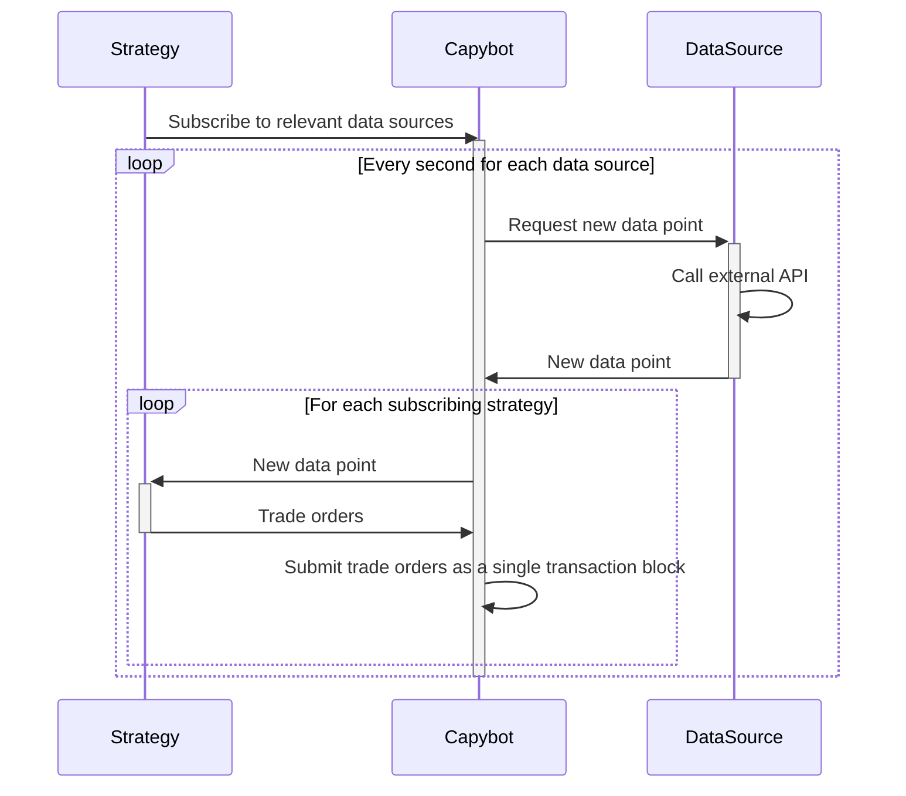

# Capy Arbitrage Bot

This repository contains a simple arbitrage bot which is designed to find and take advantage of arbitrage opportunities in different SUI DEXs.
Since it is still in BETA version, it might not be profitable.

## Features

- Finds arbitrage opportunities across multiple DEXs.
- Automatically executes trades when profitable opportunities are found.
- Supports multiple cryptocurrencies and trading pairs.

## Overview
In Capybot, **strategies** subscribe to relevant **data sources** and creates **trade orders** based on the information they get.
Every second, Capybot requests new data points from each data source. When a new data point is received, Capybot sends
it to subscribing strategies which return trade orders to Capybot. These trade orders are then exectued by submitting
transactions to the relevant swap pools modules. If a strategy returns multiple trade orders, they are submitted as a single 
transaction.



## Strategies
There are currently three treading strategies implemented in Capybot:
* `Arbitrage`: This strategy looks for [arbitrage opportunities](https://en.wikipedia.org/wiki/Triangular_arbitrage) in chains of two or more swap pools across different DEXs. It computes the product of the prices along the chain of swap pools, say SUI -> USDC -> CETUS -> SUI, and if the product is different from 1 it means there is an arbitrage opportunity.
* `RideTheTrend`: This strategy looks for [trend following](https://en.wikipedia.org/wiki/Trend_following) opportunities in a single swap pool by comparing a short moving average with a longer moving average to get an indication whether the price is going up or down.
* `MarketDifference`: This strategy compares the relative price of a token pair in a swap pool with the price of the same pair on an exchange, e.g. Binance. If the price differs, the strategy suggests to either trade or short a given token.

Strategies are located in the `src/strategies` folder, and each strategy extends the `Strategy` class which requires the
`evaluate` method to be implemented. The `evaluate` method is called every second with the latest data point from the
data sources and should return an (potentially empty) array of trade orders.

If you want to add other strategies, you should implement it as described above and add it to Capybot by calling `capybot.addStrategy` 
in `src/index.ts`.

## Data sources
There are two different kind of data sources in Capybot: Swap pools and external sources. Capybot may order trades from 
swap pools, and they provide the current relative price of the tokens in the pool. External sources may provide any kind 
of information that could be relavant for strategies.

At the moment, Capybot supports swap pools from [Cetus](https://www.cetus.zone/), [Turbos](https://turbos.finance/) and 
[Suiswap](https://suiswap.app/app/), and uses Binance as an external data sources for the relative prices of some token 
pairs.

## Installation

1. Clone this repository.
2. Install dependencies with `npm install`.

## Usage
Export the `ADMIN_PHRASE` and the `ADMIN_ADDRESS`:
```shell
export ADMIN_PHRASE=""
export ADMIN_ADDRESS="0x..."
```

1. Build the project with `npm run build`
2. Run the script with `npm run start`

This will run the bot for one hour. To run the bot for longer you should change the `duration` value in the call to `capybot.loop` in `src/index.ts`.

## Contributing

Contributions are welcome! Please open an issue or pull request if you have any suggestions or improvements.
